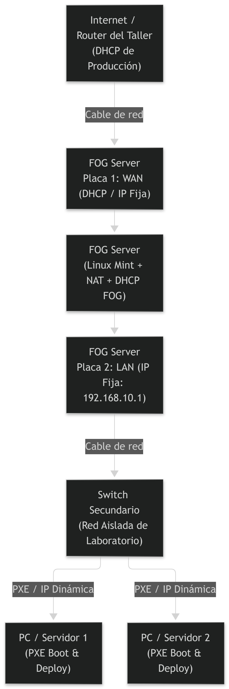

# Automated OS Deployment Architecture (FOG Project)

Arquitectura de despliegue masivo y automatizado de sistemas operativos diseñada para entornos de soporte técnico con restricciones de red (DHCP protegido).

## 🎯 Contexto y Motivación (Problem Statement)

Actualmente, el aprovisionamiento de equipos en el taller se realiza de forma manual utilizando unidades USB multiboot (Ventoy). Este método presenta varios cuellos de botella operativos:
* **Lentitud en el despliegue:** Los tiempos de booteo e instalación están limitados por el ancho de banda del puerto y la memoria USB.
* **Falta de escalabilidad:** El formateo en simultáneo depende de la cantidad de pendrives físicos disponibles.
* **Intervención manual:** Requiere que un técnico configure parámetros iniciales equipo por equipo.

Esta solución basada en **FOG Project (PXE Boot)** nace para reemplazar las unidades USB, permitiendo el despliegue desatendido de múltiples equipos en simultáneo a través de la red LAN, reduciendo drásticamente los tiempos de instalación y la intervención manual.

## 📊 Topología de Red (Network Topology)

El siguiente diagrama ilustra la estrategia de red aislada implementada mediante un servidor con doble interfaz (NAT + DHCP secundario) para evitar interferencias con el router principal del taller:

* **Placa 1 (WAN):** Conectada a la red general del taller para la salida a internet y descarga de paquetes.

* **Placa 2 (LAN - 192.168.10.1):** Controla el segmento aislado mediante un switch secundario para el aprovisionamiento de equipos por PXE sin afectar el entorno de producción.

## 🚀 Componentes Clave (Key Components)

1. **Servidor FOG (Linux Mint):** Gestión de imágenes, TFTP y almacenamiento NFS.

2. **Despliegue Desatendido:** Integración con Windows Sysprep y scripts de automatización (Batch, PowerShell) (`SetupComplete.cmd`) para la configuración dinámica de almacenamiento secundario (SSD/HDD), instalación de software adicional y activación de Windows.

3. **Aislamiento de Red:** Prevención de colisiones de DHCP corporativo.

## 🛠️ Scripts de Automatización (Automation Scripts)

En la carpeta `/scripts` se encuentra la lógica para la detección dinámica de unidades de almacenamiento basada en estado sólido o mecánico, asegurando un particionamiento robusto sin importar el orden de enumeración de la placa madre.

> 🚧 **Work In Progress (WIP):** 
> Los scripts de automatización se encuentran actualmente en fase de pruebas (Testing) en el laboratorio.

## 📘 Documentación Técnica
* [*Procedimiento de creación y generalización de la Golden Image*](docs/preparacion-golden-image.md)
* [*Estructura del archivo unattend.xml*](sysprep/unattend.xml)

